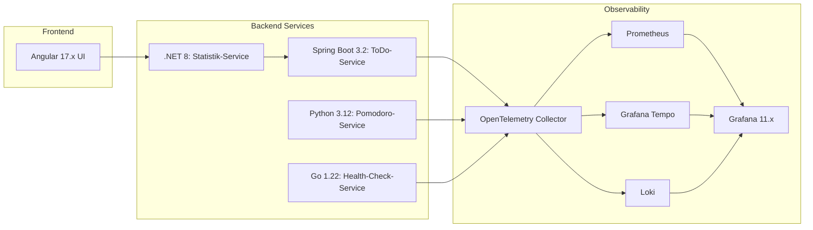

# Observability MVP Demo App – Simplifiziertes MVP

Dieses Projekt demonstriert eine vereinfachte Microservice-Architektur mit einem umfassenden Observability-Stack. Für das erste MVP werden keine Authentifizierungs- oder Login-Funktionen implementiert – stattdessen liegt der Fokus auf einer einfachen Darstellung von Statistiken und der funktionalen Umsetzung der Kern-Services.

## Inhaltsverzeichnis

- [Observability MVP Demo App – Simplifiziertes MVP](#observability-mvp-demo-app--simplifiziertes-mvp)
  - [Inhaltsverzeichnis](#inhaltsverzeichnis)
  - [Überblick](#überblick)
  - [Architektur](#architektur)

## Überblick

Das Ziel dieses MVP ist es, eine funktionsfähige Version des Observability-Stacks zu liefern, die lokal über Docker Compose gestartet werden kann. Folgende Komponenten werden umgesetzt:

- **Frontend (Angular):** Darstellung einer Benutzeroberfläche, die Statistiken (z. B. Anzahl erledigter ToDos) anzeigt.
- **Statistik-Service (.NET):** Holt regelmäßig Daten (z. B. Anzahl erledigter ToDos) vom ToDo-Service und stellt diese zur Visualisierung bereit.
- **ToDo-Service (Java Spring Boot):** Bietet CRUD-Funktionalität zur Verwaltung von ToDo-Items (Erstellen, Lesen, Aktualisieren, Löschen).
- **Pomodoro-Service (Python):** Ermöglicht das Erstellen, Speichern und Verwalten von Pomodoro-Blöcken inklusive Anpassung der Zeitintervalle und Pausen.
- **Health-Check-Service (Golang):** Prüft regelmäßig die Erreichbarkeit und Funktionsfähigkeit der anderen Services und sendet dazu Metriken und Logs.
- **Observability:** Alle Services sind instrumentiert, sodass Metriken, Traces und Logs über einen zentralen OpenTelemetry Collector weitergeleitet werden. Die Daten werden dann an Prometheus, Grafana Tempo und Loki exportiert.

## Architektur

Das folgende Mermaid-Diagramm veranschaulicht die vereinfachte Architektur:

Microservices

Frontend (Angular)
	•	Technologie: Angular 17.x (ggf. Angular 18.x, wenn stabil)
	•	Funktion: Anzeige von Statistiken (z. B. erledigte ToDos) und Bedienoberfläche für Interaktionen.
	•	Besonderheit: Verwendung von Angular Material für ein ansprechendes UI-Design.

Statistik-Service (.NET)
	•	Technologie: .NET 8.0.x
	•	Funktion: Ruft periodisch die REST-API des ToDo-Services ab, um z. B. die Anzahl abgeschlossener ToDos zu aggregieren und für das Frontend bereitzustellen.
	•	Begründung: Nutzt die neuesten Features und bietet langfristigen Support.

ToDo-Service (Java Spring Boot)
	•	Technologie: Spring Boot 3.2.x mit Java 21 (LTS)
	•	Funktion: Bietet CRUD-Endpunkte zum Anlegen, Bearbeiten, Abrufen und Löschen von ToDo-Items.
	•	Begründung: Java 21 als moderne LTS-Version in Kombination mit der stabilen Spring Boot-Version.

Pomodoro-Service (Python)
	•	Technologie: Python 3.12.x
	•	Funktion: Verwaltung von Pomodoro-Blöcken. Ermöglicht das Anlegen, Ändern und Ausführen von Zeitintervallen inklusive Pausen.
	•	Begründung: Nutzt die neueste stabile Version mit Performance-Verbesserungen.

Health-Check-Service (Golang)
	•	Technologie: Go 1.22.x
	•	Funktion: Führt einfache Health-Checks der REST-Endpunkte der anderen Services durch (z. B. HTTP-Statuscode 200) und sendet die Ergebnisse als Metriken und Logs.
	•	Begründung: Moderne, stabile Go-Version mit hervorragender Performance und einfacher Implementierung von HTTP-Checks.

Observability & Instrumentierung
	•	Instrumentierung:
	•	Alle Services werden mittels Auto-Instrumentierung mit den neuesten OpenTelemetry SDKs ausgestattet.
	•	Ein zentraler OpenTelemetry Collector sammelt die Daten und leitet sie an folgende Ziele weiter:
	•	Prometheus: Metriken
	•	Grafana Tempo: Traces
	•	Loki: Logs
	•	Best Practices:
	•	Strukturierte Logs (z. B. im JSON-Format)
	•	Einheitliche Correlation IDs zur Verknüpfung der Observability-Daten

Deployment
	•	Lokale Ausführung:
	•	Das gesamte MVP lässt sich mit Docker Compose starten.
	•	Alle Services sowie der OpenTelemetry Collector, Prometheus, Grafana Tempo, Loki und Grafana werden als Container definiert.
	•	Vorgabe:
	•	Ein docker-compose.yml-File wird bereitgestellt, sodass ein einfacher docker-compose up-Befehl das gesamte System hochfährt.

Entwicklungsworkflow
	•	Source Code Verwaltung: GitHub
	•	CI/CD: Zukünftige Integration über GitLab CI/CD, um Builds, Tests und Deployments zu automatisieren.
	•	Weiterentwicklung:
	•	Neue Features und Optimierungen werden schrittweise hinzugefügt.
	•	Die Dokumentation wird kontinuierlich angepasst.