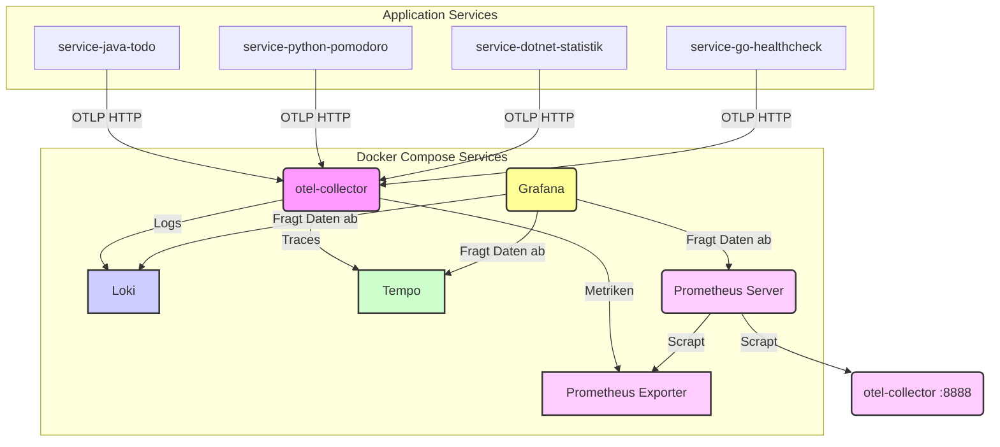

# Observability Stack für SRE ToDo MVP

Dieser Ordner enthält die Konfiguration für den Observability-Stack, der mit Docker Compose bereitgestellt wird. Er besteht aus OpenTelemetry Collector, Prometheus, Loki, Tempo und Grafana.

## Architektur

**Datenfluss:**

1.  **Anwendungs-Services:** Senden Logs, Traces und Metriken via OTLP HTTP an den OpenTelemetry Collector (`otel-collector:4318`). Der Java-Service wird dabei vom OTel Java Agent automatisch instrumentiert.
2.  **OpenTelemetry Collector (`otel-collector`):**
    *   Empfängt Daten auf Port `4318` (OTLP HTTP).
    *   Prozessiert die Daten (Batching, Memory Limiting, Ressourcenattribute hinzufügen).
    *   **Exportiert Logs:** An Loki (`http://loki:3100/loki/api/v1/push`) über den **alten `loki` Exporter**. Der `resource`-Prozessor wird verwendet, um das Ressourcenattribut `service.name` als Loki-Label `service.name` zu setzen (Hinweis: Punkt, kein Unterstrich!).
    *   **Exportiert Traces:** An Tempo (`http://tempo:4318`) via OTLP HTTP.
    *   **Exportiert Metriken:** An einen internen Prometheus Exporter (`otel-collector:8889`).
    *   Stellt eigene Metriken bereit (`otel-collector:8888`), die von Prometheus gescraped werden.
3.  **Loki:** Empfängt Logs vom Collector und speichert sie. Verwendet das Label `service.name` zur Identifizierung der Quelle.
4.  **Tempo:** Empfängt Traces vom Collector und speichert sie.
5.  **Prometheus Server:**
    *   Scrapt Metriken vom OTel Collector (`otel-collector:8889`).
    *   Scrapt Metriken direkt von den Services (falls diese einen `/metrics` oder `/actuator/prometheus` Endpunkt bereitstellen - z.B. `service-java-todo`).
    *   Scrapt eigene Metriken vom Collector (`otel-collector:8888`).
    *   Speichert die Metriken.
6.  **Grafana:**
    *   Visualisiert Daten aus Loki (Logs), Tempo (Traces) und Prometheus (Metriken).
    *   Datenquellen werden automatisch über Provisioning (`./grafana/provisioning/datasources`) konfiguriert.
    *   Dashboards können über Provisioning (`./grafana/provisioning/dashboards`) bereitgestellt werden (Beispiel für Java-Service hinzugefügt).
    *   Erlaubt anonymen Zugriff (`GF_AUTH_ANONYMOUS_ENABLED=true`).
    *   Ermöglicht die Korrelation von Traces zu Logs und Logs zu Traces durch Konfiguration der Tempo- und Loki-Datenquellen (siehe Abschnitt unten).

## Konfigurationsdateien

*   **`otel-collector-config.yaml`**: Konfiguriert die Receiver, Prozessoren (inkl. `resource` zur Loki-Label-Generierung) und Exporter (inkl. `loki` Exporter) des Collectors sowie die Pipelines.
*   **`prometheus.yml`**: Definiert die Scraping-Jobs für Prometheus.
*   **`tempo-config.yaml`**: Konfiguriert Tempo.
*   **`./grafana/provisioning/datasources/datasources.yaml`**: Definiert die Prometheus-, Loki- und Tempo-Datenquellen für Grafana. **Hinweis:** Die Trace-Log-Korrelation wird manuell in der Grafana UI konfiguriert (siehe unten), nicht mehr über Provisioning in dieser Datei.
*   **`./grafana/provisioning/dashboards/dashboard-provider.yaml`**: Konfiguriert Grafana, um Dashboards aus dem Verzeichnis zu laden.
*   **`./grafana/provisioning/dashboards/service-java-todo.json`**: Beispiel-Dashboard für den Java ToDo Service.

## Trace-Log-Korrelation in Grafana

Um zwischen Traces in Tempo und Logs in Loki springen zu können, muss die Korrelation manuell in den Grafana Datenquellen konfiguriert werden:

1.  **Tempo Datenquelle konfigurieren (Trace to Logs):**
    *   Gehe zu "Administration" -> "Data sources" -> "Tempo".
    *   Scrolle zu "Trace to logs".
    *   Aktiviere die Funktion.
    *   Wähle die Loki-Datenquelle aus.
    *   Aktiviere "Filter by Trace ID" und "Filter by Span ID".
    *   Füge unter "Tags" das Tag `service.name` hinzu und stelle sicher, dass es auf das Log Label `service.name` gemappt wird.
    *   Speichere die Konfiguration ("Save & Test").

2.  **Loki Datenquelle konfigurieren (Logs to Trace):**
    *   Gehe zu "Administration" -> "Data sources" -> "Loki".
    *   Scrolle zu "Derived Fields".
    *   Klicke auf "Add".
    *   **Matcher regex:** `traceID=(\\w+)` (oder an das Log-Format anpassen, falls die Trace ID anders erscheint).
    *   **Name:** `TraceID`
    *   **URL / query:** `${__value.raw}`
    *   **Internal link:** Wähle die Tempo-Datenquelle aus.
    *   Speichere die Konfiguration ("Save & Test").

Nun sollte in der Tempo-Ansicht ein Icon erscheinen, um zu den Logs zu springen, und in der Loki-Ansicht die TraceID klickbar sein, um zum Trace zu gelangen.

## Wichtige Endpunkte & Ports (Host-Perspektive)

*   **Grafana UI:** `http://localhost:3000`
*   **Prometheus UI:** `http://localhost:9090`
*   **ToDo Service API:** `http://localhost:8080`
*   **Statistik Service API:** `http://localhost:8001`
*   **Pomodoro Service API:** `http://localhost:8002`
*   **Healthcheck Service API:** `http://localhost:8003`
*   **OTel Collector OTLP HTTP:** `http://localhost:4318` (Relevant für Services, die *außerhalb* von Docker laufen)
*   **Loki API:** `http://localhost:3100`
*   **Tempo API:** `http://localhost:3200`

## Starten & Stoppen

Der gesamte Stack wird über die Haupt-`docker-compose.yml` im Projekt-Root-Verzeichnis gesteuert:

*   Starten/Erstellen: `docker-compose up -d --build`
*   Stoppen: `docker-compose down`
*   Stoppen & Volumes löschen: `docker-compose down -v` 